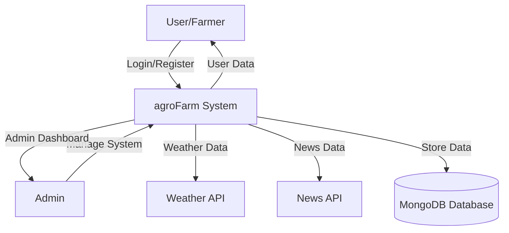
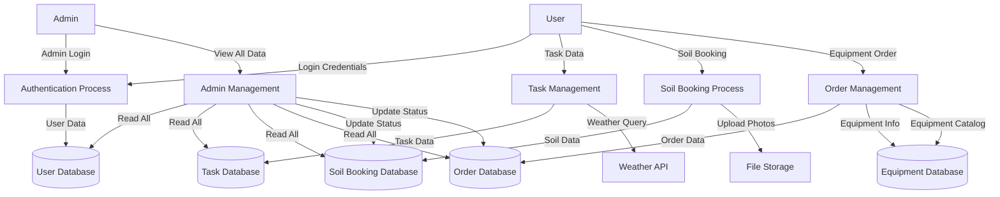
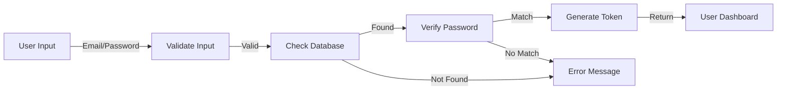
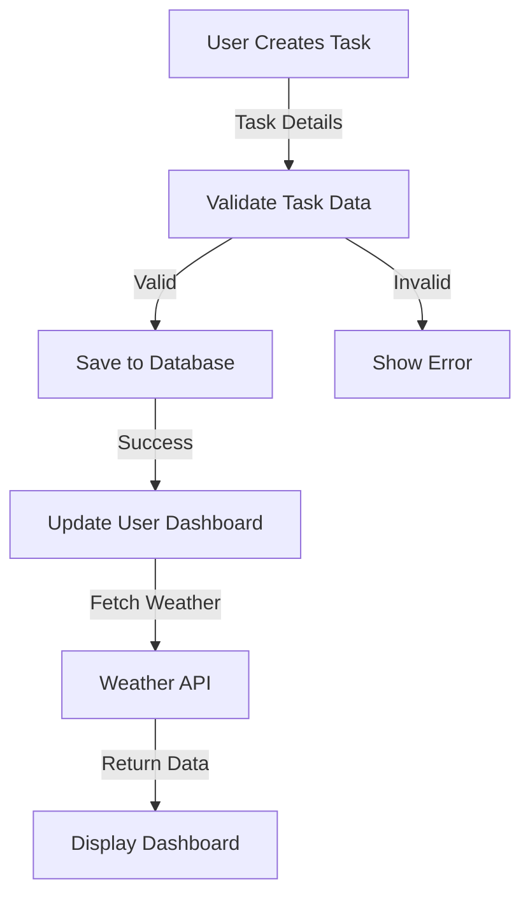
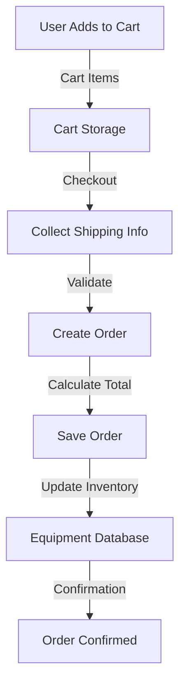
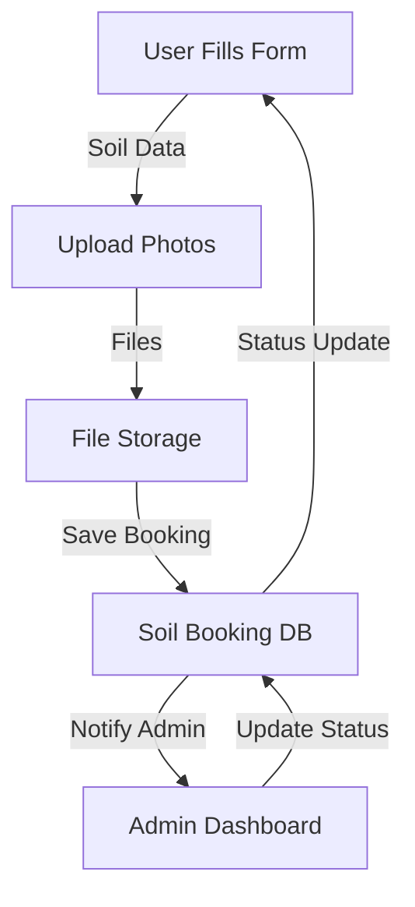

# Data Flow Diagram (DFD) - agroFarm System

## Level 0 - Context Diagram

## Level 1 - System Overview

## Level 2 - Detailed Process Flows

### Authentication Flow

### Task Management Flow

### Order Management Flow

### Soil Booking Flow

---

## Data Flow Descriptions

### External Entities
- **User/Farmer**: Regular users who use the platform
- **Admin**: System administrators
- **Weather API**: External weather service
- **News API**: External news service

### Data Stores
- **User Database**: Stores user accounts and profiles
- **Task Database**: Stores farm tasks
- **Soil Booking Database**: Stores soil test bookings
- **Order Database**: Stores equipment orders
- **Equipment Database**: Stores equipment catalog
- **File Storage**: Stores uploaded images

### Processes
1. **Authentication**: User login/registration
2. **Task Management**: Create, update, delete tasks
3. **Soil Booking**: Submit and manage soil test requests
4. **Order Management**: Cart and order processing
5. **Admin Management**: View and manage all system data

---

## Data Flows

| Flow ID | From | To | Data |
|---------|------|-----|------|
| D1 | User | Authentication | Login credentials |
| D2 | Authentication | User Database | User data |
| D3 | User | Task Management | Task details |
| D4 | Task Management | Task Database | Task records |
| D5 | User | Soil Booking | Soil form data |
| D6 | Soil Booking | File Storage | Image files |
| D7 | User | Order Management | Cart items |
| D8 | Order Management | Order Database | Order records |
| D9 | Admin | Admin Management | Admin queries |
| D10 | Admin Management | All Databases | Read/Update operations |
