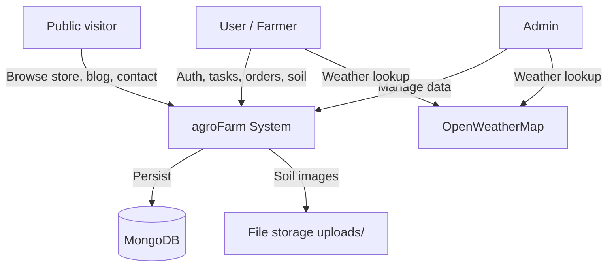
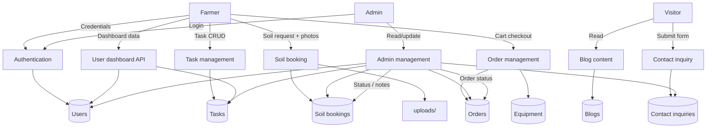
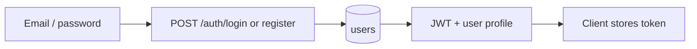
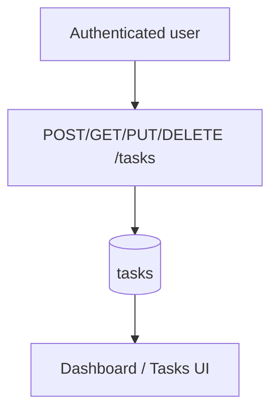
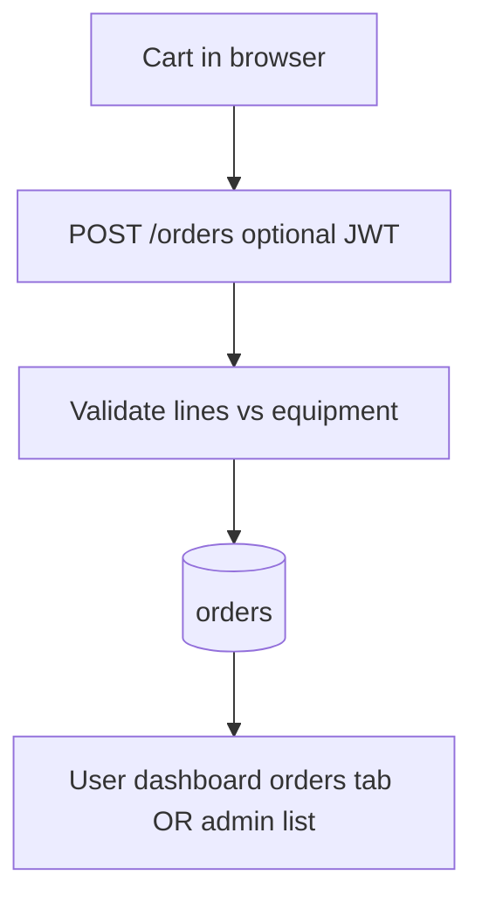
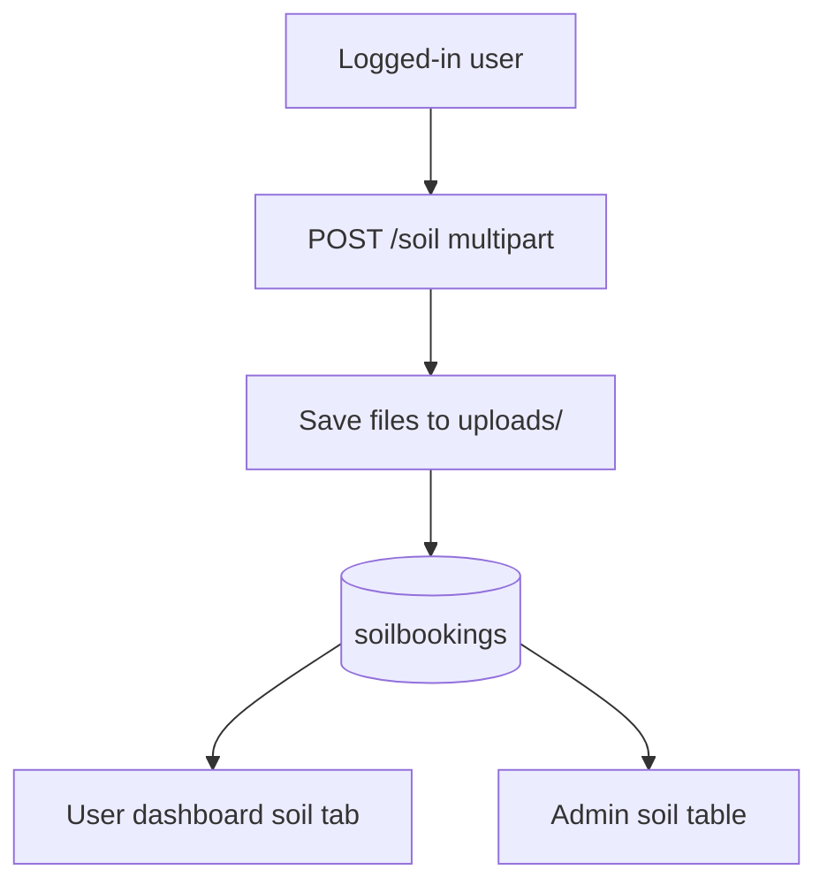
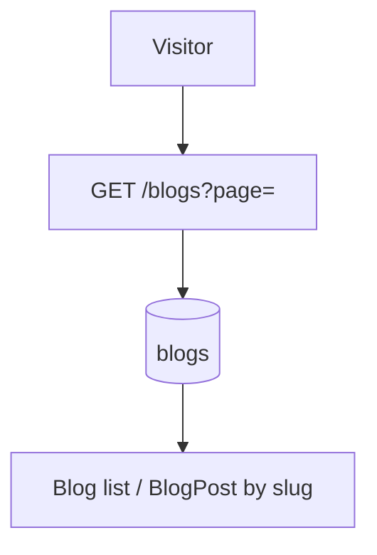
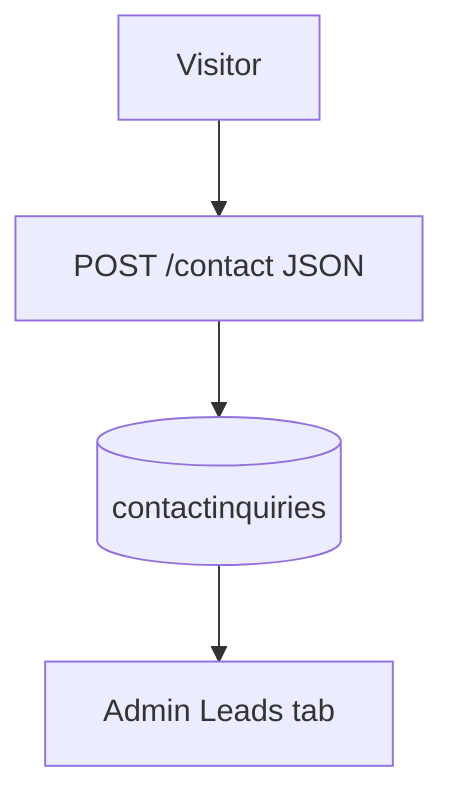

# Data Flow Diagram (DFD) - agroFarm System

Aligned with current flows: MongoDB-backed blog, public contact form, user dashboard sections for soil and orders, and admin **Leads** from contact inquiries.

## Level 0 - Context Diagram

```mermaid
graph TD
    Farmer[User / Farmer] -->|Auth, tasks, orders, soil| System[agroFarm System]
    Visitor[Public visitor] -->|Browse store, blog, contact| System
    Admin[Admin] -->|Manage data| System
    System -->|Persist| DB[(MongoDB)]
    System -->|Soil images| Files[File storage uploads/]
    Farmer -->|Weather lookup| WeatherAPI[OpenWeatherMap]
    Admin -->|Weather lookup| WeatherAPI
```

Note: Weather requests go from the **browser** to OpenWeatherMap; they are not proxied through the Express API.

## Level 1 - System Overview

```mermaid
graph TD
    Farmer -->|Credentials| Auth[Authentication]
    Farmer -->|Task CRUD| TaskMgmt[Task management]
    Farmer -->|Soil request + photos| SoilMgmt[Soil booking]
    Farmer -->|Cart checkout| OrderMgmt[Order management]
    Farmer -->|Dashboard data| UserDash[User dashboard API]

    Visitor -->|Read| BlogRead[Blog content]
    Visitor -->|Submit form| ContactInq[Contact inquiry]

    Admin -->|Login| Auth
    Admin -->|Read/update| AdminMgmt[Admin management]

    Auth --> UserDB[(Users)]
    TaskMgmt --> TaskDB[(Tasks)]
    SoilMgmt --> SoilDB[(Soil bookings)]
    SoilMgmt --> Files[uploads/]
    OrderMgmt --> OrderDB[(Orders)]
    OrderMgmt --> EquipDB[(Equipment)]
    UserDash --> UserDB
    UserDash --> TaskDB

    BlogRead --> BlogDB[(Blogs)]
    ContactInq --> LeadDB[(Contact inquiries)]

    AdminMgmt --> UserDB
    AdminMgmt --> TaskDB
    AdminMgmt --> SoilDB
    AdminMgmt --> OrderDB
    AdminMgmt --> LeadDB
    AdminMgmt -->|Status / notes| SoilDB
    AdminMgmt -->|Order status| OrderDB
```

## Level 2 - Selected process flows

### Authentication

```mermaid
graph LR
    A[Email / password] --> B[POST /auth/login or register]
    B --> C[(users)]
    C --> D[JWT + user profile]
    D --> E[Client stores token]
```

### Task management

```mermaid
graph TD
    A[Authenticated user] --> B[POST/GET/PUT/DELETE /tasks]
    B --> C[(tasks)]
    C --> D[Dashboard / Tasks UI]
```

### Order management (COD)

```mermaid
graph TD
    A[Cart in browser] --> B[POST /orders optional JWT]
    B --> C[Validate lines vs equipment]
    C --> D[(orders)]
    D --> E[User dashboard orders tab OR admin list]
```

### Soil booking

```mermaid
graph TD
    A[Logged-in user] --> B[POST /soil multipart]
    B --> C[Save files to uploads/]
    C --> D[(soilbookings)]
    D --> E[User dashboard soil tab]
    D --> F[Admin soil table]
```

### Blog (CMS in database)

```mermaid
graph TD
    A[Visitor] --> B[GET /blogs?page=]
    B --> C[(blogs)]
    C --> D[Blog list / BlogPost by slug]
```

### Contact lead

```mermaid
graph TD
    A[Visitor] --> B[POST /contact JSON]
    B --> C[(contactinquiries)]
    C --> D[Admin Leads tab]
```

---

## Data stores (logical)

| Store | Mongoose model | Typical collection |
|-------|----------------|--------------------|
| Users | User | users |
| Tasks | Task | tasks |
| Soil bookings | SoilBooking | soilbookings |
| Orders | Order | orders |
| Equipment | Equipment | equipment |
| Blogs | Blog | blogs |
| Contact inquiries | ContactInquiry | contactinquiries |
| Files | — | `backend/uploads/` |

## Processes

1. **Authentication** — Register / login, JWT issuance.
2. **User dashboard** — Aggregate user, task stats, finance summary (`GET /user/dashboard`).
3. **Task management** — Per-user CRUD.
4. **Soil booking** — Authenticated submission with optional photos.
5. **Order management** — Guest or logged-in checkout; user sees orders when `user` is set on the order.
6. **Blog** — Public read of MongoDB articles.
7. **Contact** — Public capture of inquiries.
8. **Admin management** — Cross-tenant read/update; contact **leads** read-only listing in current API.

## Data flow table (representative)

| ID | From | To | Data |
|----|------|-----|------|
| D1 | User | Auth | Credentials |
| D2 | Auth | Users | Account records |
| D3 | User | Tasks | Task payloads |
| D4 | User | Soil | Form + files |
| D5 | Soil | File storage | Image binaries |
| D6 | User/Visitor | Orders | Cart lines, address, mobile |
| D7 | Visitor | Contact | name, email, message |
| D8 | Visitor | Blogs | — (read posts) |
| D9 | Admin | Admin APIs | Queries, status updates |
| D10 | OpenWeatherMap | Browser | Weather JSON (parallel to backend) |
