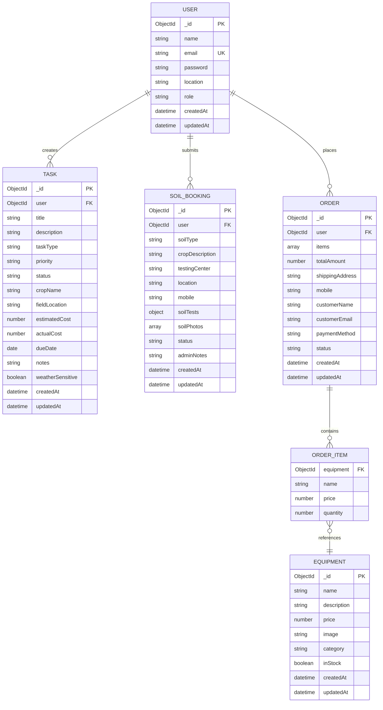

# Entity Relationship (ER) Diagram - agroFarm System

## ER Diagram

## Entity Descriptions

### USER Entity
- **Primary Key**: _id
- **Unique**: email
- **Attributes**: name, email, password, location, role (user/admin)
- **Relationships**: 
  - One-to-Many with TASK
  - One-to-Many with SOIL_BOOKING
  - One-to-Many with ORDER

### TASK Entity
- **Primary Key**: _id
- **Foreign Key**: user (references USER)
- **Attributes**: title, description, taskType, priority, status, cropName, fieldLocation, estimatedCost, actualCost, dueDate, notes, weatherSensitive
- **Relationships**: Many-to-One with USER

### SOIL_BOOKING Entity
- **Primary Key**: _id
- **Foreign Key**: user (references USER)
- **Attributes**: soilType, cropDescription, testingCenter, location, mobile, soilTests (pH, nitrogen, phosphorus, potassium), soilPhotos, status, adminNotes
- **Relationships**: Many-to-One with USER

### EQUIPMENT Entity
- **Primary Key**: _id
- **Attributes**: name, description, price, image, category, inStock
- **Relationships**: One-to-Many with ORDER_ITEM

### ORDER Entity
- **Primary Key**: _id
- **Foreign Key**: user (references USER, nullable for guest orders)
- **Attributes**: items (array of ORDER_ITEM), totalAmount, shippingAddress, mobile, customerName, customerEmail, paymentMethod, status
- **Relationships**: 
  - Many-to-One with USER (optional)
  - One-to-Many with ORDER_ITEM

### ORDER_ITEM Entity (Embedded)
- **Foreign Key**: equipment (references EQUIPMENT)
- **Attributes**: name, price, quantity
- **Relationships**: Many-to-One with EQUIPMENT, Embedded in ORDER

## Relationship Cardinalities

| Relationship | Type | Description |
|-------------|------|-------------|
| USER → TASK | 1:N | One user can create many tasks |
| USER → SOIL_BOOKING | 1:N | One user can submit many soil bookings |
| USER → ORDER | 1:N | One user can place many orders |
| ORDER → ORDER_ITEM | 1:N | One order contains many items |
| EQUIPMENT → ORDER_ITEM | 1:N | One equipment can be in many order items |

## Attributes Details

### USER
- **name**: String, required
- **email**: String, required, unique
- **password**: String, required, hashed
- **location**: String, optional
- **role**: Enum ["user", "admin"], default "user"

### TASK
- **taskType**: Enum ["Irrigation", "Fertilizer", "Harvest", "Pesticide", "Other"]
- **priority**: Enum ["Low", "Medium", "High"]
- **status**: Enum ["pending", "in-progress", "completed"]

### SOIL_BOOKING
- **soilTests**: Object with boolean fields (pH, nitrogen, phosphorus, potassium)
- **soilPhotos**: Array of file paths
- **status**: Enum ["pending", "in-progress", "completed"]

### ORDER
- **paymentMethod**: String, default "COD" (Cash on Delivery)
- **status**: Enum ["pending", "confirmed", "shipped", "delivered"]
- **user**: Optional (allows guest orders)

### EQUIPMENT
- **category**: String, default "General"
- **inStock**: Boolean, default true
