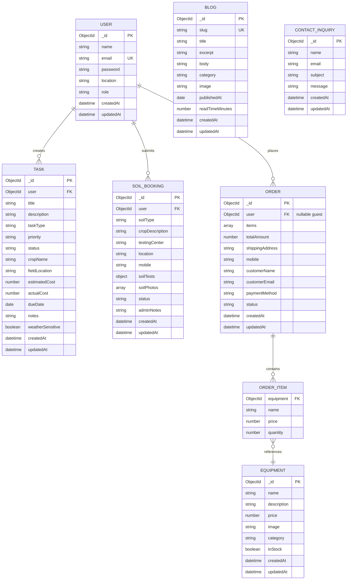

# Entity Relationship (ER) Diagram - agroFarm System

Reflects Mongoose models in `backend/models/`.

## ER Diagram

```mermaid
erDiagram
    USER ||--o{ TASK : creates
    USER ||--o{ SOIL_BOOKING : submits
    USER ||--o{ ORDER : places
    ORDER ||--o{ ORDER_ITEM : contains
    ORDER_ITEM }o--|| EQUIPMENT : references

    USER {
        ObjectId _id PK
        string name
        string email UK
        string password
        string location
        string role
        datetime createdAt
        datetime updatedAt
    }

    TASK {
        ObjectId _id PK
        ObjectId user FK
        string title
        string description
        string taskType
        string priority
        string status
        string cropName
        string fieldLocation
        number estimatedCost
        number actualCost
        date dueDate
        string notes
        boolean weatherSensitive
        datetime createdAt
        datetime updatedAt
    }

    SOIL_BOOKING {
        ObjectId _id PK
        ObjectId user FK
        string soilType
        string cropDescription
        string testingCenter
        string location
        string mobile
        object soilTests
        array soilPhotos
        string status
        string adminNotes
        datetime createdAt
        datetime updatedAt
    }

    EQUIPMENT {
        ObjectId _id PK
        string name
        string description
        number price
        string image
        string category
        boolean inStock
        datetime createdAt
        datetime updatedAt
    }

    ORDER {
        ObjectId _id PK
        ObjectId user FK "nullable guest"
        array items
        number totalAmount
        string shippingAddress
        string mobile
        string customerName
        string customerEmail
        string paymentMethod
        string status
        datetime createdAt
        datetime updatedAt
    }

    ORDER_ITEM {
        ObjectId equipment FK
        string name
        number price
        number quantity
    }

    BLOG {
        ObjectId _id PK
        string slug UK
        string title
        string excerpt
        string body
        string category
        string image
        date publishedAt
        number readTimeMinutes
        datetime createdAt
        datetime updatedAt
    }

    CONTACT_INQUIRY {
        ObjectId _id PK
        string name
        string email
        string subject
        string message
        datetime createdAt
        datetime updatedAt
    }
```

## Entity summaries

### USER

- **PK**: `_id`
- **Unique**: `email`
- **role**: `"user"` | `"admin"`
- **Relations**: 1:N Task, SoilBooking, Order (order.user optional for guests)

### TASK

- **FK**: `user` → User (required)
- **taskType**: Irrigation | Fertilizer | Harvest | Pesticide | Other
- **priority**: Low | Medium | High
- **status**: pending | in-progress | completed

### SOIL_BOOKING

- **FK**: `user` → User (required)
- **soilTests**: `{ pH, nitrogen, phosphorus, potassium }` booleans
- **soilPhotos**: string paths under `/uploads/...`
- **status**: pending | in-progress | completed
- **adminNotes**: optional string (admin updates)

### EQUIPMENT

- Catalog only; referenced by embedded order line items.

### ORDER

- **user**: optional ObjectId (guest checkout)
- **items**: embedded subdocuments (equipment ref + snapshot name, price, quantity)
- **status**: pending | confirmed | shipped | delivered
- **paymentMethod**: default `"COD"`

### ORDER_ITEM (embedded in Order)

- Not a separate collection; shown for clarity.
- **equipment**: ObjectId ref Equipment

### BLOG

- **slug**: unique, lowercase (used in `/blog/:slug`)
- Content managed in DB (seed scripts: `seedBlog.js`, etc.)
- No foreign key to User in the current schema (author not modeled)

### CONTACT_INQUIRY

- Public contact form submissions
- **No** user FK — standalone leads for admin review (`GET /admin/contacts`)

## Cardinalities

| From | To | Cardinality |
|------|-----|-------------|
| User | Task | 1:N |
| User | SoilBooking | 1:N |
| User | Order | 1:N (optional participation on Order side) |
| Order | OrderItem | 1:N embedded |
| Equipment | Order line | 1:N logical (via ref in embedded items) |

## MongoDB indexes (from code)

- **Blog**: indexes on `publishedAt`, `category` (`blogSchema.index` in `Blog.js`).
- **User**: unique index on `email` (Mongoose unique).
