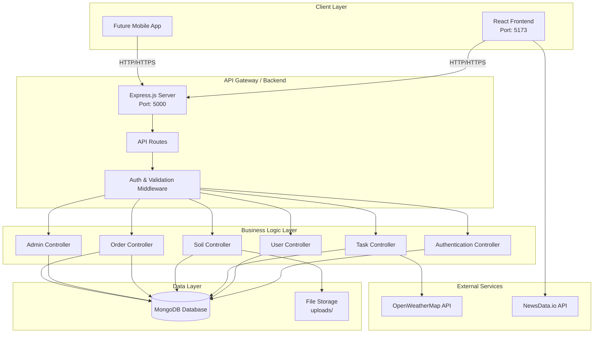
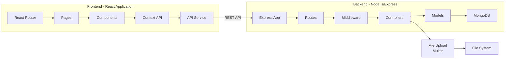
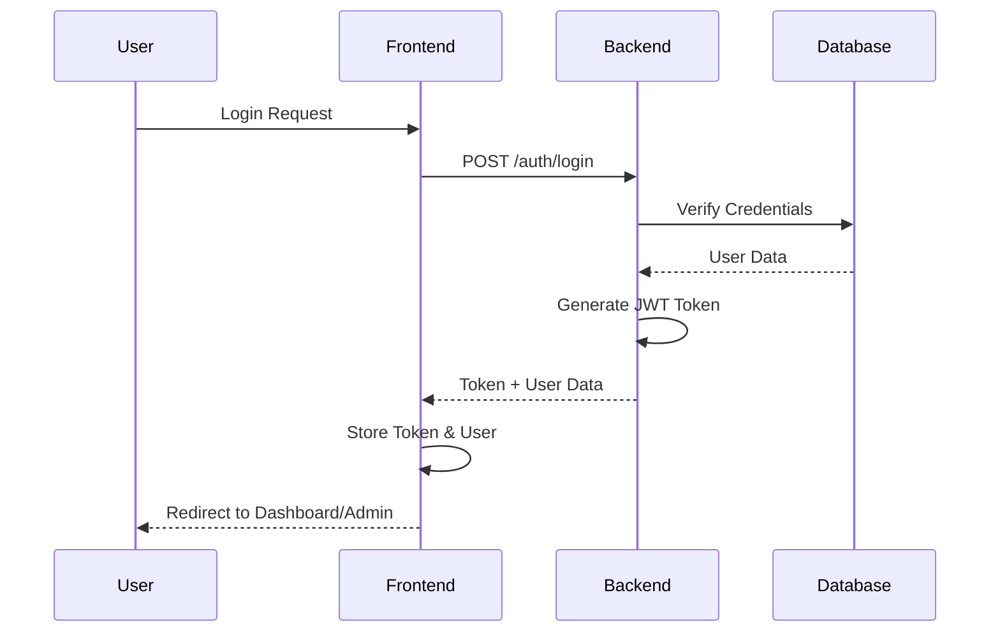
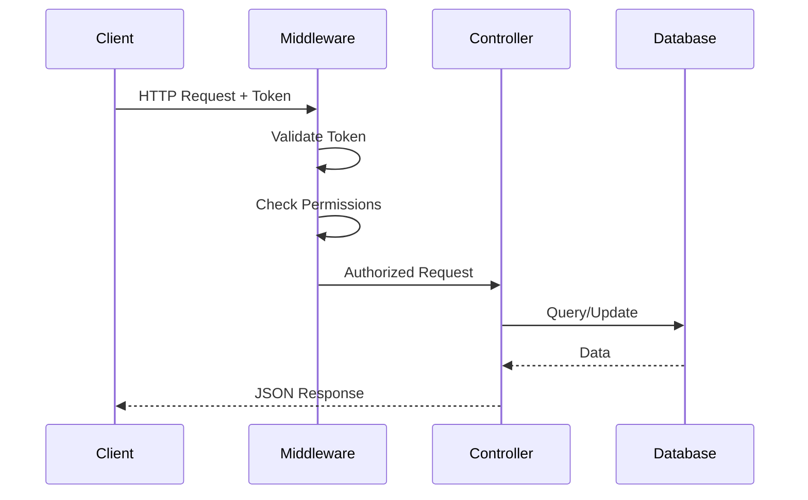
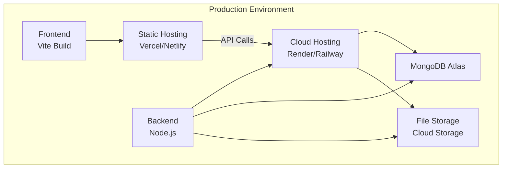

# System Architecture - agroFarm Platform

## High-Level Architecture



## Detailed Component Architecture



## Technology Stack

### Frontend
- **Framework**: React 19.2.0
- **Routing**: React Router DOM 6.30.3
- **State Management**: React Context API
- **Styling**: Plain CSS (inline styles)
- **Animations**: AOS (Animate On Scroll) 2.3.4
- **HTTP Client**: Axios 1.13.5
- **Build Tool**: Vite 7.3.1

### Backend
- **Runtime**: Node.js
- **Framework**: Express.js 4.18.2
- **Database**: MongoDB (Mongoose 8.0.3)
- **Authentication**: JWT (jsonwebtoken 9.0.2)
- **Password Hashing**: bcryptjs 2.4.3
- **File Upload**: Multer 2.0.2
- **CORS**: cors 2.8.5

### External APIs
- **Weather**: OpenWeatherMap API
- **News**: NewsData.io API

## System Layers

### 1. Presentation Layer (Frontend)
```
┌─────────────────────────────────────┐
│  React Components                    │
│  - Pages (Home, Dashboard, etc.)    │
│  - Components (Navbar, Cards, etc.)  │
│  - Context (Auth, Cart)             │
└─────────────────────────────────────┘
```

### 2. Application Layer (Backend)
```
┌─────────────────────────────────────┐
│  Express Routes & Controllers        │
│  - /auth (login, register)         │
│  - /user (dashboard)                │
│  - /tasks (CRUD operations)         │
│  - /soil (soil bookings)            │
│  - /equipment (catalog)             │
│  - /orders (order management)       │
│  - /admin (admin operations)        │
└─────────────────────────────────────┘
```

### 3. Data Access Layer
```
┌─────────────────────────────────────┐
│  Mongoose Models                     │
│  - User Model                        │
│  - Task Model                       │
│  - SoilBooking Model                │
│  - Equipment Model                  │
│  - Order Model                      │
└─────────────────────────────────────┘
```

### 4. Data Storage Layer
```
┌─────────────────────────────────────┐
│  MongoDB Collections                 │
│  - users                            │
│  - tasks                            │
│  - soilbookings                     │
│  - equipment                        │
│  - orders                           │
└─────────────────────────────────────┘
```

## API Architecture

### RESTful API Structure
```
Base URL: http://localhost:5000/ (or deployed URL)

├── /auth
│   ├── POST /register    - User registration
│   └── POST /login       - User login
│
├── /user
│   └── GET /dashboard    - Get user dashboard data
│
├── /tasks
│   ├── GET /             - Get user's tasks
│   ├── POST /            - Create task
│   ├── GET /:id          - Get task by ID
│   ├── PUT /:id          - Update task
│   └── DELETE /:id      - Delete task
│
├── /soil
│   ├── POST /            - Create soil booking
│   └── GET /             - Get user's soil bookings
│
├── /equipment
│   └── GET /             - Get all equipment
│
├── /orders
│   ├── POST /            - Create order (COD)
│   └── GET /my           - Get user's orders
│
└── /admin
    ├── GET /stats        - Get admin statistics
    ├── GET /users        - Get all users
    ├── GET /tasks        - Get all tasks
    ├── GET /soil         - Get all soil bookings
    ├── PUT /soil/:id/status - Update soil booking status
    ├── GET /orders       - Get all orders
    └── PUT /orders/:id/status - Update order status
```

## Authentication Flow



## Request Flow



## Security Architecture

```
┌─────────────────────────────────────┐
│  Security Layers                    │
├─────────────────────────────────────┤
│  1. CORS Configuration              │
│  2. JWT Token Authentication        │
│  3. Password Hashing (bcrypt)       │
│  4. Input Validation                │
│  5. Role-Based Access Control       │
│  6. File Upload Validation          │
└─────────────────────────────────────┘
```

## Deployment Architecture



## Data Flow Architecture

```
User Input → Frontend Validation → API Request → 
Backend Middleware → Controller → Database → 
Response → Frontend Update → User Feedback
```

## File Upload Architecture

```
Client → Multer Middleware → File Validation → 
Save to uploads/ → Store Path in Database → 
Serve via Static Route /uploads
```

## Scalability Considerations

- **Horizontal Scaling**: Stateless API allows multiple instances
- **Database**: MongoDB supports sharding and replication
- **Caching**: Can add Redis for session/token caching
- **CDN**: Static assets can be served via CDN
- **Load Balancing**: Multiple backend instances behind load balancer
