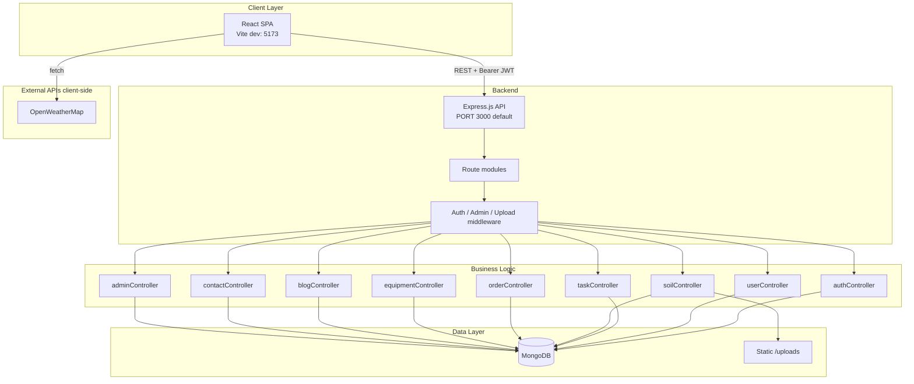
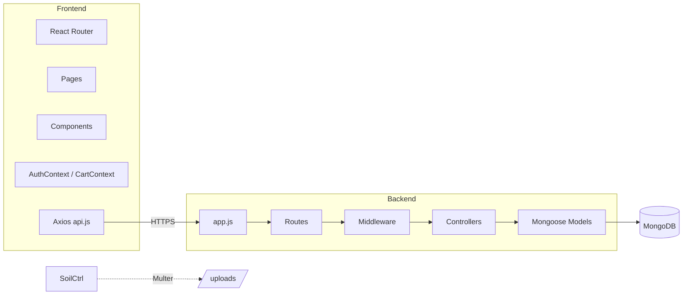
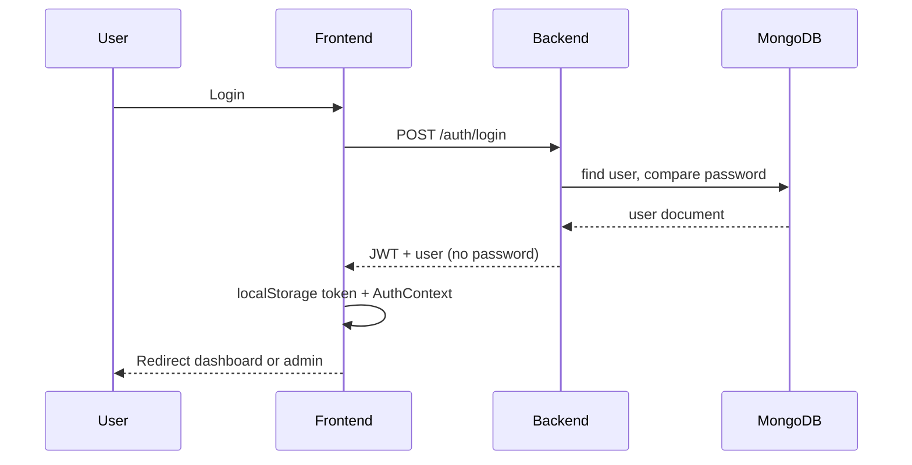
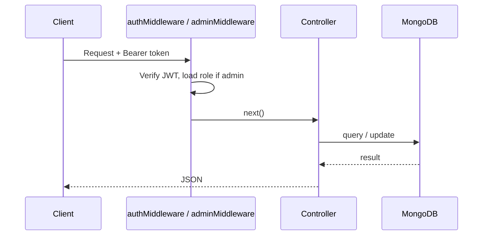

# System Architecture - agroFarm Platform

Documentation aligned with the current repository: Express + MongoDB backend, React (Vite) frontend, JWT auth, and REST APIs under route modules in `backend/`.

## High-Level Architecture


```mermaid
graph TB
    subgraph "Client Layer"
        WebApp[React SPA<br/>Vite dev: 5173]
    end

    subgraph "Backend"
        Express[Express.js API<br/>PORT 3000 default]
        Routes[Route modules]
        MW[Auth / Admin / Upload middleware]
    end

    subgraph "Business Logic"
        AuthCtrl[authController]
        UserCtrl[userController]
        TaskCtrl[taskController]
        SoilCtrl[soilController]
        OrderCtrl[orderController]
        EquipCtrl[equipmentController]
        BlogCtrl[blogController]
        ContactCtrl[contactController]
        AdminCtrl[adminController]
    end

    subgraph "Data Layer"
        MongoDB[(MongoDB)]
        Uploads[Static /uploads]
    end

    subgraph "External APIs client-side"
        WeatherAPI[OpenWeatherMap]
    end

    WebApp -->|REST + Bearer JWT| Express
    WebApp -->|fetch| WeatherAPI

    Express --> Routes
    Routes --> MW
    MW --> AuthCtrl
    MW --> UserCtrl
    MW --> TaskCtrl
    MW --> SoilCtrl
    MW --> OrderCtrl
    MW --> EquipCtrl
    MW --> BlogCtrl
    MW --> ContactCtrl
    MW --> AdminCtrl

    AuthCtrl --> MongoDB
    UserCtrl --> MongoDB
    TaskCtrl --> MongoDB
    SoilCtrl --> MongoDB
    SoilCtrl --> Uploads
    OrderCtrl --> MongoDB
    EquipCtrl --> MongoDB
    BlogCtrl --> MongoDB
    ContactCtrl --> MongoDB
    AdminCtrl --> MongoDB
```

## Detailed Component Flow


```mermaid
graph LR
    subgraph "Frontend"
        Router[React Router]
        Pages[Pages]
        Components[Components]
        Ctx[AuthContext / CartContext]
        Api[Axios api.js]
    end

    subgraph "Backend"
        App[app.js]
        R[Routes]
        M[Middleware]
        Ctrl[Controllers]
        Models[Mongoose Models]
    end

    Api -->|HTTPS| App
    App --> R --> M --> Ctrl --> Models --> MongoDB[(MongoDB)]
    SoilCtrl -.->|Multer| FS[/uploads/]
```

## Technology Stack

### Frontend (`frontend/package.json`)

| Area | Technology |
|------|------------|
| UI | React 19, React Router DOM 6 |
| Build | Vite 7 |
| HTTP | Axios |
| Icons | lucide-react |
| Motion | GSAP + @gsap/react, AOS |
| Styling | Global CSS (`index.css`, `styles/components.css`, `styles/landing.css`) plus scoped `<style>` on some pages |

### Backend (`backend/package.json`)

| Area | Technology |
|------|------------|
| Runtime | Node.js (ES modules) |
| Server | Express 4 |
| Database | MongoDB via Mongoose 8 |
| Auth | JWT (jsonwebtoken), bcryptjs |
| Uploads | Multer → `uploads/` served at `GET /uploads/...` |
| Config | dotenv via `loadEnv.js` |

### External services

- **OpenWeatherMap**: Called from the **browser** (Dashboard / Admin weather UI), not from Express.
- **Farm blog**: Articles are stored in **MongoDB** (`Blog` model), exposed as `GET /blogs` and `GET /blogs/:slug`. There is no NewsData.io integration in the active blog pages.

## System Layers

### 1. Presentation layer (frontend)

- **Public**: Home, Store, Cart, Know your soil, Blog list & post, Contact, Login, Register.
- **Authenticated (user)**: Dashboard (overview, weather, soil bookings, equipment orders), Tasks.
- **Admin**: Admin dashboard (users, tasks, soil bookings, orders, contact leads, weather).

Contexts: **AuthContext** (user + JWT in `localStorage`), **CartContext** (cart persisted in `localStorage`).

### 2. Application layer (backend routes)

Mounted in `app.js`:

| Prefix | Purpose |
|--------|---------|
| `/auth` | Register, login |
| `/user` | Authenticated user dashboard payload |
| `/tasks` | CRUD tasks (JWT required) |
| `/admin` | Admin-only stats and CRUD views |
| `/soil` | Soil bookings (JWT + multipart upload) |
| `/equipment` | Equipment catalog (read) |
| `/orders` | Create order (optional JWT), list my orders (JWT) |
| `/blogs` | List / paginate posts, get by slug (public) |
| `/contact` | Submit contact inquiry (public POST) |

### 3. Data access layer (Mongoose)

Models under `backend/models/`: **User**, **Task**, **SoilBooking**, **Equipment**, **Order**, **Blog**, **ContactInquiry**.

### 4. Persistence (MongoDB collections)

Typical collection names: `users`, `tasks`, `soilbookings`, `equipment`, `orders`, `blogs`, `contactinquiries` (Mongoose pluralization).

## REST API Summary

Base URL: `http://localhost:3000` (or `VITE_API_URL` from the frontend). All JSON unless noted.

```
/auth
  POST /register
  POST /login

/user
  GET  /dashboard          (JWT)

/tasks
  POST   /
  GET    /
  GET    /:id
  PUT    /:id
  DELETE /:id               (all JWT)

/soil
  POST /                    (JWT, multipart: soilPhotos + fields)
  GET  /                    (JWT, current user’s bookings)

/equipment
  GET /                     (public catalog)

/orders
  POST /                    (optional JWT — guest checkout allowed)
  GET  /my                  (JWT)

/blogs
  GET /                     (optional ?page=&pageSize=)
  GET /:slug                (single article)

/contact
  POST /                    (public JSON: name, email, subject?, message)

/admin                      (JWT + admin role)
  GET  /stats
  GET  /users
  GET  /tasks
  GET  /soil
  PUT  /soil/:id/status     (body: status, optional adminNotes)
  GET  /orders
  PUT  /orders/:id/status   (body: status)
  GET  /contacts            (contact form leads)
```

Static files: `GET /uploads/<filename>` (soil photos, etc.).

## Authentication Flow


```mermaid
sequenceDiagram
    participant U as User
    participant F as Frontend
    participant B as Backend
    participant DB as MongoDB

    U->>F: Login
    F->>B: POST /auth/login
    B->>DB: find user, compare password
    DB-->>B: user document
    B-->>F: JWT + user (no password)
    F->>F: localStorage token + AuthContext
    F-->>U: Redirect dashboard or admin
```

Axios attaches `Authorization: Bearer <token>` for protected routes (`frontend/src/services/api.js`).

## Request Flow (protected route)


```mermaid
sequenceDiagram
    participant C as Client
    participant M as authMiddleware / adminMiddleware
    participant Ctrl as Controller
    participant DB as MongoDB

    C->>M: Request + Bearer token
    M->>M: Verify JWT, load role if admin
    M->>Ctrl: next()
    Ctrl->>DB: query / update
    DB-->>Ctrl: result
    Ctrl-->>C: JSON
```

## Security (as implemented)

- CORS enabled for browser clients.
- Passwords hashed with bcrypt on register.
- JWT for API authentication; admin routes use `adminMiddleware`.
- Soil uploads: Multer (type/limits per `uploadMiddleware.js`).
- Input validation varies by controller (required fields on contact, orders, etc.).

## File uploads

`POST /soil` → Multer saves images under `backend/uploads/` → paths stored on `SoilBooking.soilPhotos` → served via `express.static` on `/uploads`.

## Deployment (reference)

Frontend: `pnpm build` / `npm run build` → static assets. Backend: Node process with `MONGO_URI` (or `MONGODB_URI` per `loadEnv.js`). MongoDB Atlas compatible.

## Scalability notes

- API is stateless (JWT), suitable for horizontal scaling behind a load balancer.
- File storage can move to S3-compatible storage with URL fields instead of local paths.
- Optional future layers: Redis cache, rate limiting on `/contact` and `/auth`.
